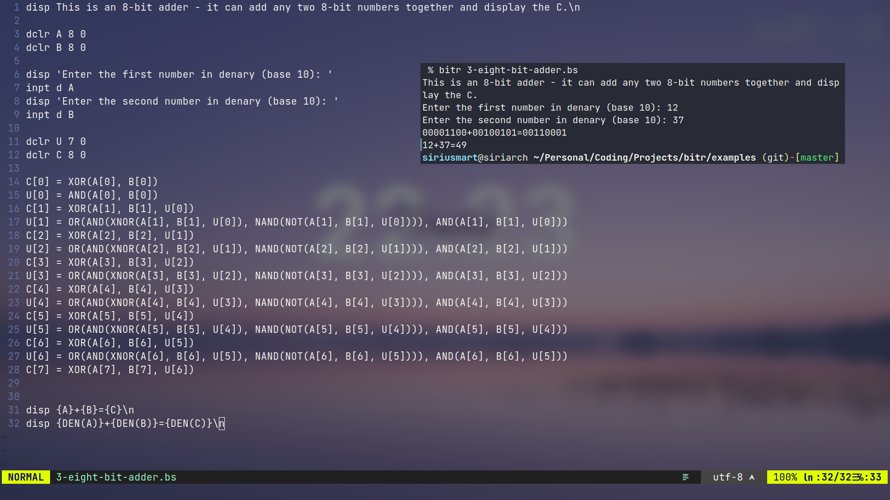

***Read more in the <a href="https://siriusmart.github.io/bitscript" target=_blank>user manual</a> (including language syntax).***

# Overview

BitScript is an esoteric language designed to simulate logic gates.

**Bitr** is a minimal BitScript interpreter written in Rust, it does not include any external dependencies.

(Stands for *bit-runner*, pronounced *bitter*.)

## Features

- BitScript is a text based *logic gate simulator*. 
- BitScript is *Turing complete*, allowing for complex designs.
- BitScript contains a file based *module system* (components), which declutters code.

> Examples of what you can do with BitScript can be found in <a href="https://github.com/siriusmart/bitr/tree/master/examples" target=_blank>examples</a>.

## Roadmap

- [x] Assigning values to a single cell, whole array and range or cells.
- [x] Common logic gates.
- [x] Input with base 8, 10 and 16 numbers.
- [x] Goto, label, and if statements.
- [x] Reusable components.
- [ ] Arrays.
- [ ] Global std library of components.
- [ ] Unicode characters from binary.
- [ ] Running system commands
- [ ] Browser interpreter with Web Assembly.
<!-- - [ ] Convert BitScript into a diagram of logic gates. -->
